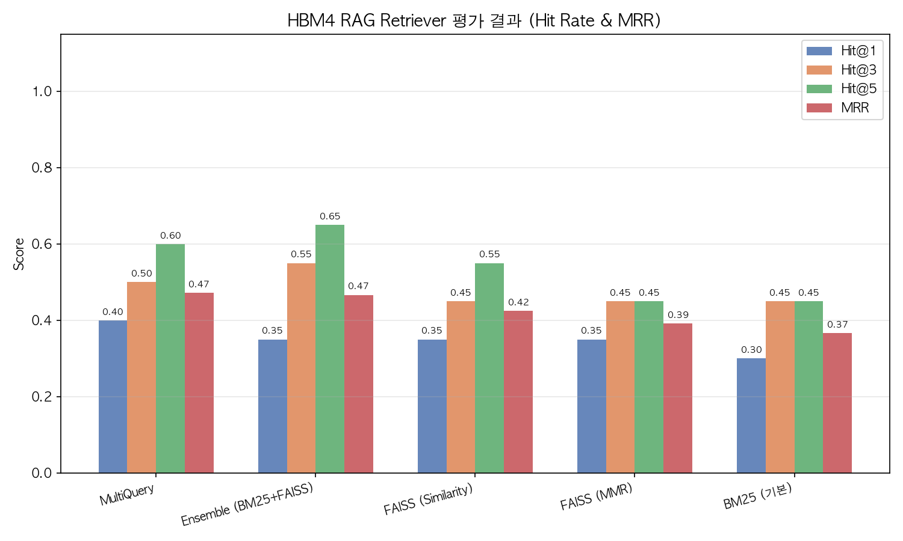

# HBM4 Hybrid Bonding 기술 전략 분석 보고서 자동 생성 시스템

HBM4 세대의 핵심 공정 기술인 Cu-Cu Hybrid Bonding에 대해 경쟁사(SK하이닉스, Samsung, TSMC)의 기술 성숙도(TRL)를 자동 분석하고, R&D 담당자가 선행개발 과제 선정 및 공정개발 우선순위 결정에 활용할 수 있는 보고서를 자동 생성하는 Multi-Agent 시스템입니다.

---

## Overview

- **Objective** : 공개 논문·특허·산업 동향을 분석하여 경쟁사별 HBM4 Hybrid Bonding 기술 개발 단계(TRL)를 추정하고, R&D 의사결정에 활용 가능한 기술 전략 분석 보고서를 자동 생성
- **Method** : LangGraph Supervisor 패턴 기반 Multi-Agent 파이프라인. RAG(논문 16편, 914청크)와 실시간 웹 검색(Tavily)을 병렬 수행한 후 Analysis → Draft → Formatting 순으로 보고서 생성
- **Tools** : LangGraph, LangChain, OpenAI GPT-4o-mini, FAISS, Tavily Search, ReportLab

---

## Features

- **논문 기반 RAG 검색** : HBM4 Hybrid Bonding 관련 논문 16편을 사전 구축된 FAISS 벡터 DB에서 검색하여 기술적 근거 추출
- **실시간 웹 검색** : Tavily API를 통해 Samsung·SK하이닉스·TSMC의 최신 동향을 실시간 수집 (최대 109건)
- **TRL 추정** : 공개 지표(학회 발표 수치·특허 출원 패턴·고객 샘플 공급 여부)를 기반으로 경쟁사별 TRL 4~9 구간 추정
- **확증편향 방지 전략** : 긍정·부정·역관점 3종 쿼리를 강제 생성하고, 동일 출처 50% 초과 시 재검색 수행
- **Self-Reflection 품질 검증** : Draft Agent가 SC1~SC6 체크리스트 기반 자기 검증을 수행하며, 미충족 시 Supervisor가 재작성 요청 (최대 2회)
- **한글 PDF 출력** : NanumGothic 폰트 기반 ReportLab PDF 생성, 실패 시 Markdown Fallback 자동 전환
- **RAG 평가** : Hit Rate@K(K=1,3,5) 및 MRR 지표로 Retriever 성능 비교 (FAISS·BM25·Ensemble·MultiQuery)

---

## Tech Stack

| Category   | Details                                              |
|------------|------------------------------------------------------|
| Framework  | LangGraph, LangChain, Python 3.11                    |
| LLM        | GPT-4o-mini (OpenAI API)                             |
| Retrieval  | FAISS + BM25 Hybrid Ensemble                         |
| Embedding  | text-embedding-3-small (OpenAI)                      |
| Web Search | Tavily Search API                                    |
| Output     | ReportLab (PDF), Markdown Fallback                   |
| Evaluation | Hit Rate@1/3/5, MRR                                  |
| Infra      | uv, python-dotenv                                    |

---

## Agents

| Agent | 역할 |
|---|---|
| **Supervisor** | Rule 기반 분기 제어. LLM 호출 없이 sc_scores·retry 카운터만으로 next 노드 결정 |
| **RAG Agent** | 사전 구축된 FAISS DB에서 top-k 청크 검색. trl_signal 자동 추출 포함 |
| **Web Search Agent** | Tavily API 기반 경쟁사별 실시간 웹 검색. 확증편향 방지를 위한 역관점 쿼리 포함 |
| **Analysis Agent** | RAG+웹 결과를 종합하여 경쟁사별 TRL 추정 및 criteria_scores 산출. JSON 반환 |
| **Draft Agent** | report_template.md 구조 기반 보고서 초안 작성. Self-Reflection SC 체크 포함 |
| **Formatting Node** | Markdown → PDF 변환 (NanumGothic). 실패 시 Markdown Fallback 자동 전환 |

---

## Architecture

```
User Query
    ↓
Supervisor (Rule 기반 분기)
    ├─ next="rag"        → RAG Agent        → Supervisor
    ├─ next="web"        → Web Search Agent → Supervisor
    ├─ next="analysis"   → Analysis Agent   → Supervisor
    ├─ next="draft"      → Draft Agent      → Supervisor
    ├─ next="formatting" → Formatting Node  → Supervisor
    └─ next="END"        → 종료
```


---

## RAG 평가 결과

논문 16편(914청크) 대상, QA 20개 자동 생성 기반 평가 (overlap_threshold=0.3)

| Retriever | Hit@1 | Hit@3 | Hit@5 | MRR |
|---|---|---|---|---|
| **Ensemble (BM25+FAISS) ✅** | **0.350** | **0.550** | **0.650** | **0.467** |
| FAISS (Similarity) | 0.350 | 0.450 | 0.550 | 0.425 |
| FAISS (MMR) | 0.350 | 0.450 | 0.450 | 0.392 |
| BM25 (기본) | 0.300 | 0.450 | 0.450 | 0.367 |

> Ensemble (BM25+FAISS)가 전 지표에서 최고 성능을 기록하여 최종 Retriever로 채택


---

## Directory Structure

```
skala-ai-service-prj/
├── data/
│   ├── papers/                # HBM4 Hybrid Bonding 논문 16편
│   ├── TRL.md                 # TRL 기준 정의
│   └── report_template.md     # 보고서 템플릿
├── agents/
│   ├── rag_agent.py           # RAG 검색 Agent
│   ├── web_search_agent.py    # Tavily 웹 검색 Agent
│   ├── analysis_agent.py      # TRL 분석 Agent
│   ├── draft_agent.py         # 보고서 초안 작성 Agent
│   ├── formatting_node.py     # PDF/Markdown 변환 Node
│   └── supervisor.py          # Rule 기반 Supervisor
├── prompts/
│   ├── analysis_prompt.txt    # Analysis Agent 시스템 프롬프트
│   └── draft_prompt.txt       # Draft Agent 시스템 프롬프트
├── scripts/
│   ├── prebuilt_db.py         # FAISS 벡터 DB 사전 구축
│   ├── md_to_pdf.py           # Markdown → PDF 변환 유틸
│   └── rag_evaluation.py      # RAG Retriever 평가 스크립트
├── outputs/                   # 생성된 보고서 저장
├── .cache/faiss_index/        # 사전 구축된 벡터 DB
├── graph.py                   # LangGraph StateGraph 정의
├── app.py                     # 실행 진입점
└── README.md
```

---

## Quickstart

```bash
# 1. 환경 설치
uv sync

# 2. 환경변수 설정
cp .env.example .env
# OPENAI_API_KEY, TAVILY_API_KEY 입력

# 3. 벡터 DB 구축
python scripts/prebuilt_db.py ./data/papers

# 4. 보고서 생성
python app.py

# 5. RAG 평가 (선택)
python scripts/rag_evaluation.py
```

---

## Contributors

| 이름 | 역할 |
|---|---|
| **이한결** | Supervisor 설계, Analysis·Draft·Formatting Agent 구현, 프롬프트 엔지니어링, RAG 평가 |
| **한채윤** | RAG Agent 구현, FAISS 벡터 DB 구축, 논문 데이터 수집, LangGraph StateGraph 구현 |